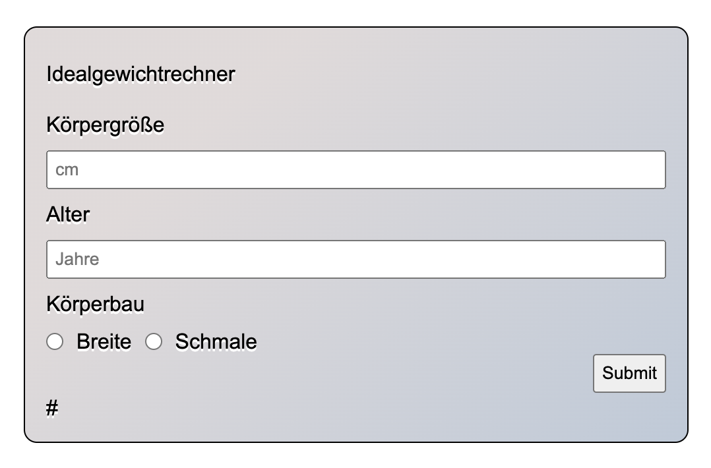
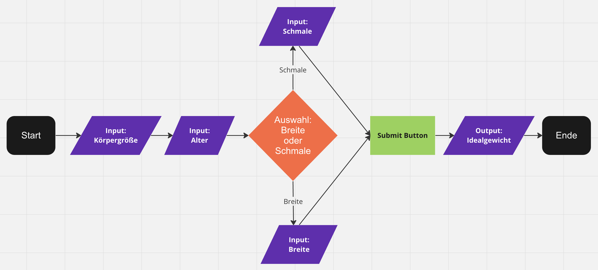

# Idealgewichtrechner

Ein Rechentool zum Ermittteln des Idealgweichts anhand von Körpergröße, Alter und Statur.

Angewandte Lerninhalte:
- SASS
- Arrow-Function
- addEventListener
- Flowchart und Arbeitsplanung
## Screenshots

## Flowchart / Programmablaufsplan

